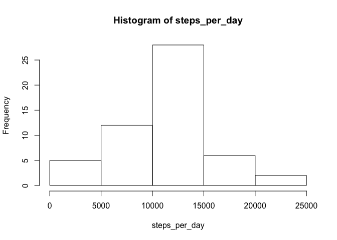

## Loading and preprocessing the data
Set working directory and read the data into R.

```r
rm(list=ls())
setwd("/Users/Andy/DataSciCoursera/ReproducibleResearch/CourseProject1/")
dat <- read.csv("activity.csv")
```

Take a look at the data

```r
str(dat)
```

```
## 'data.frame':	17568 obs. of  3 variables:
##  $ steps   : int  NA NA NA NA NA NA NA NA NA NA ...
##  $ date    : Factor w/ 61 levels "2012-10-01","2012-10-02",..: 1 1 1 1 1 1 1 1 1 1 ...
##  $ interval: int  0 5 10 15 20 25 30 35 40 45 ...
```

```r
head(dat)
```

```
##   steps       date interval
## 1    NA 2012-10-01        0
## 2    NA 2012-10-01        5
## 3    NA 2012-10-01       10
## 4    NA 2012-10-01       15
## 5    NA 2012-10-01       20
## 6    NA 2012-10-01       25
```

```r
tail(dat)
```

```
##       steps       date interval
## 17563    NA 2012-11-30     2330
## 17564    NA 2012-11-30     2335
## 17565    NA 2012-11-30     2340
## 17566    NA 2012-11-30     2345
## 17567    NA 2012-11-30     2350
## 17568    NA 2012-11-30     2355
```

Convert date from factor to date class.

```r
class(dat$date)
```

```
## [1] "factor"
```

```r
dat$date <- as.Date(dat$date)
class(dat$date)
```

```
## [1] "Date"
```


## What is mean total number of steps taken per day?

Plot a histogram of the total steps per day


```r
steps_per_day <- tapply(dat$steps,dat$date,sum)
hist(steps_per_day)
```

<!-- -->

Compute the mean and median steps per day.


```r
mean_steps_day <- mean(steps_per_day,na.rm = TRUE)
med_steps_day <- median(steps_per_day,na.rm = TRUE)
```
The mean number of steps per day is 1.0766189\times 10^{4}.  
The median number of steps per day is 10765.  

## What is the average daily activity pattern?

Make a time series plot (i.e. type = "l") of the 5-minute interval (x-axis) and the average number of steps taken, averaged across all days (y-axis)


```r
mean_steps_interval <- as.numeric(tapply(dat$steps, dat$interval, mean,na.rm=TRUE))
plot(as.numeric(unique(dat$interval)),mean_steps_interval,type="l",ylab="Avg # steps taken",xlab="Interval",main="Mean # Steps per Interval")
```

<!-- -->

Which 5-minute interval, on average across all the days in the dataset, contains the maximum number of steps?


```r
maxint<-unique(dat$interval)[which.max(mean_steps_interval)]
```
The interval 835 contains the maximum number of steps.

## Imputing missing values

Calculate and report the total number of missing values in the dataset (i.e. the total number of rows with NAs)


```r
N_na <- length(which(is.na(dat$steps)))
pct_na <- N_na / length(dat$steps) *100
```
There are 2304 NAs in the dataset, which is 13.1147541 percent of the data.

Devise a strategy for filling in all of the missing values in the dataset. The strategy does not need to be sophisticated. For example, you could use the mean/median for that day, or the mean for that 5-minute interval, etc.

I will fill in NAs with the mean for each interval.

```r
idna <-which(is.na(dat$steps))
steps_fill<-dat$steps
for (i in seq_along(idna)){
        steps_fill[idna[i]] <- mean_steps_interval[which(dat$interval[idna[i]]==unique(dat$interval))]
}
```


Create a new dataset that is equal to the original dataset but with the missing data filled in.


```r
dat_filled <- data.frame(steps=steps_fill,date=dat$date,interval=dat$interval)
head(dat_filled)
```

```
##       steps       date interval
## 1 1.7169811 2012-10-01        0
## 2 0.3396226 2012-10-01        5
## 3 0.1320755 2012-10-01       10
## 4 0.1509434 2012-10-01       15
## 5 0.0754717 2012-10-01       20
## 6 2.0943396 2012-10-01       25
```

Make a histogram of the total number of steps taken each day and Calculate and report the mean and median total number of steps taken per day. Do these values differ from the estimates from the first part of the assignment? What is the impact of imputing missing data on the estimates of the total daily number of steps?


```r
steps_per_day_fill <- tapply(dat_filled$steps,dat_filled$date,sum)
hist(steps_per_day_fill)
```

<!-- -->

Recompute the mean and median steps per day.  


```r
mean_steps_day_fill <- mean(steps_per_day_fill)
med_steps_day_fill <- median(steps_per_day_fill)
```
The mean number of steps per day with NAs filled is 1.0766189\times 10^{4}, compared to 1.0766189\times 10^{4} with NAs, a ratio of 1.  
The median number of steps per day with NAs filled is 1.0766189\times 10^{4}, compared to 10765 with NAs, a ratio of 1.0001104.  
So imputing missing data has little or no effect on the estimates of the total daily number of steps.  


## Are there differences in activity patterns between weekdays and weekends?

Create a new factor variable in the dataset with two levels -- "weekday" and "weekend" indicating whether a given date is a weekday or weekend day.


```r
weekday_list <- c("Monday","Tuesday","Wednesday","Thursday","Friday")
weekend_list <- c("Saturday","Sunday")

id_week <- which(weekdays(dat$date) %in% weekday_list)
id_weekend <- which(weekdays(dat$date) %in% weekend_list)

dat$Group[id_week] <-"week"
dat$Group[id_weekend] <-"weekend"
dat$Group <- as.factor(dat$Group)

## Make a new dataframe w/ steps averaged by interval for both weekend and week separately
a<-subset(dat,as.character(dat$Group)=="week")
b<-subset(dat,as.character(dat$Group)=="weekend")

steps_per_int_week<-as.numeric(tapply(a$steps,a$interval,mean,na.rm=TRUE))
steps_per_int_weekend<-as.numeric(tapply(b$steps,b$interval,mean,na.rm=TRUE))

dat2a=data.frame(interval=unique(dat$interval),steps=steps_per_int_week,Group="week")
dat2b=data.frame(interval=unique(dat$interval),steps=steps_per_int_weekend,Group="weekend")
dat2=rbind(dat2a,dat2b)
```

Make a panel plot containing a time series plot (i.e. type = "l") of the 5-minute interval (x-axis) and the average number of steps taken, averaged across all weekday days or weekend days (y-axis). 


```r
library(lattice)
xyplot(steps~interval | Group,data=dat2,layout=c(1,2),type="l")
```

<!-- -->

The plot shows a difference in activity patterns between weekends and weekdays. During the week, activity appears to peak during the morning rushour, with some smaller peaks later in the day. On the weekends, activity level is more consistent throughout the day. 
